思通舆情 是一款开源免费的舆情系统，支持本地化部署。支持对海量舆情数据分析和挖掘。
 

### 思通舆情 的功能：

-   舆情监测：通过全文搜索、来源搜索、热搜监测等多重功能实现对全网文本、图片、视频舆情实时发现;
-   舆情预警：根据用户设置预警条件，判别舆情信息，并第一时间通过多渠道告知用户;
-   舆情分析：全网事件分析、事件分析、传播分析、竞品分析、评论分析、热度指数，6类大数据分析;
-   舆情报告：一键快速生成日、周、月、季度报告,自带行业舆情案例库，为舆情应对提供参考。

### 思通舆情 的优势：

-   开源开放：零门槛，线上快速获取和安装；快速获取用户反馈、按月发布新版本；
-   简单易用：极易上手，通过鼠标点击和拖拽即可完成分析；
-   秒级响应：超大数据量下秒级查询返回延时；

### 思通舆情 的数据：

-   新闻媒体：新闻、app、电子报、境外新闻；
-   网络自媒体：搜狐、百家号、今日头条、博客、企鹅号、微信公众号、微博；
-   境外社交媒体：twitter、facebook、及其他境外社交媒体；
-   论坛：贴吧、论坛、问答、知乎；
-   短视频：抖音、快手，等众多平台。

### 思通舆情 技术栈：

- 数据库：MySQL
- 数据检索：Elasticsearch
- 文章储存：Mongodb
- 系统缓存：Redis
- 消息队列：kafak & rabbitMQ
- 深度学习：PaddlePaddle
- 网络爬虫：WebMagic(java) & scrapy（python）
- 开发框架：SpringBoot
- 开发语言：Java JEE

## UI 展示
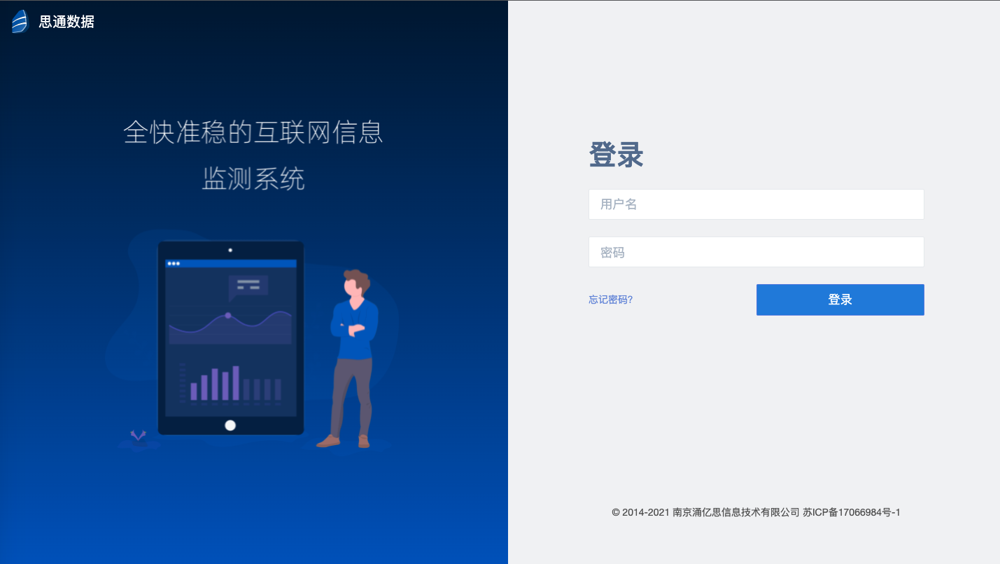
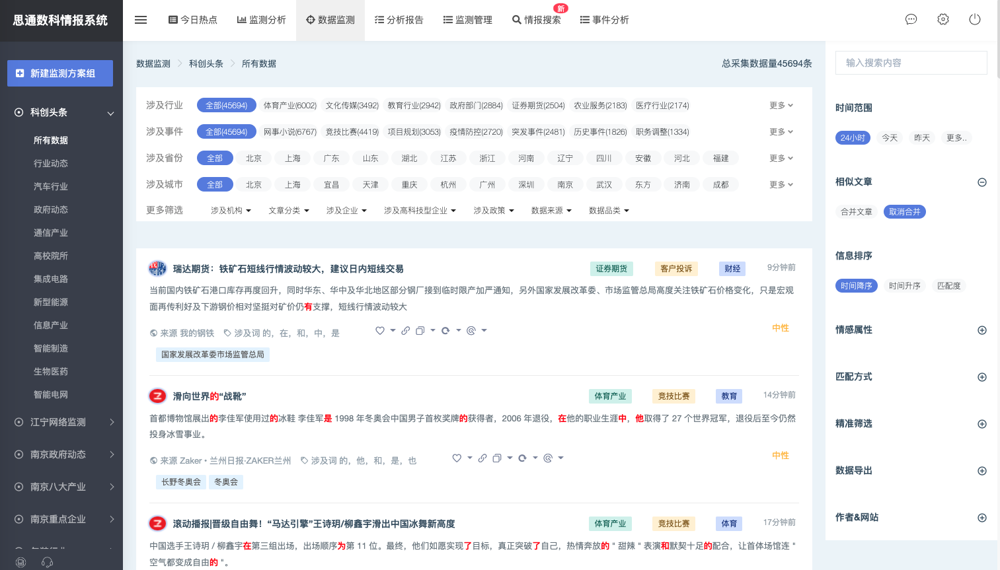
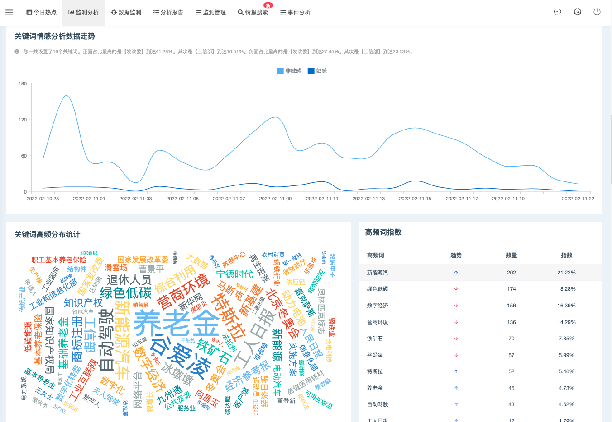
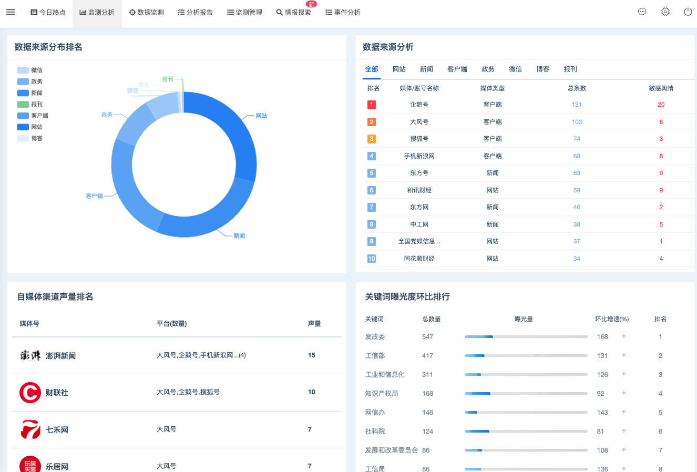
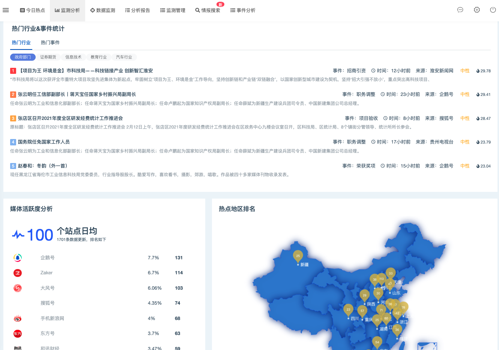

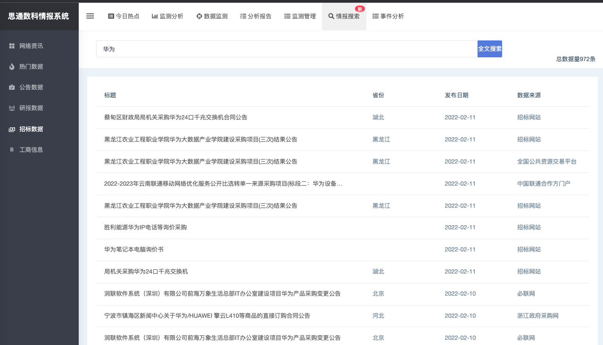
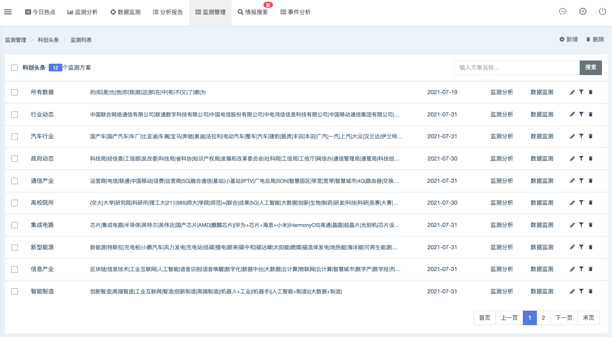
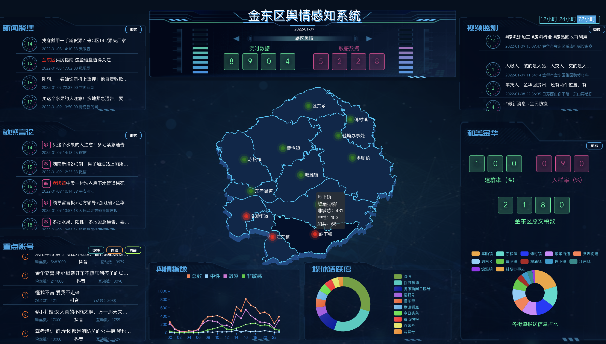
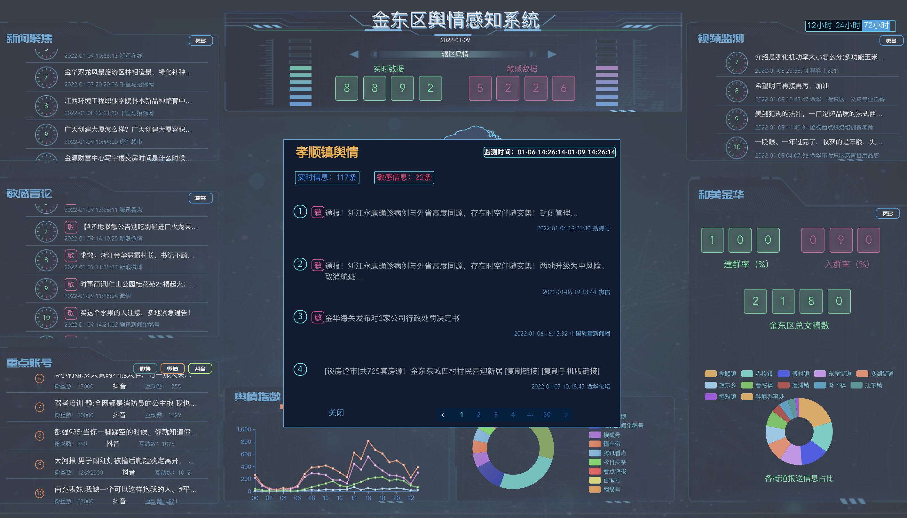

## 系统架构

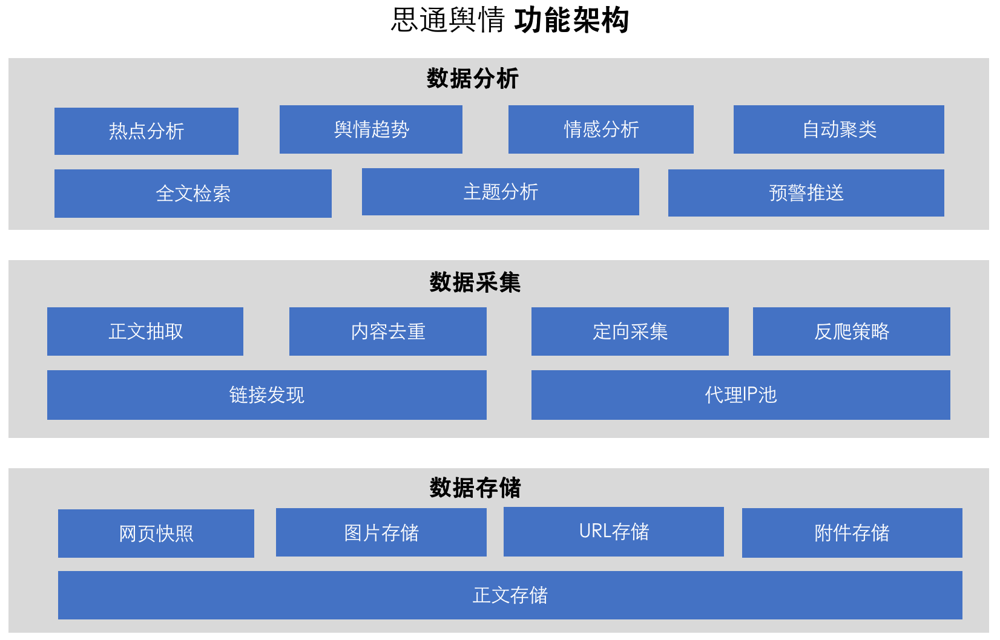

## 功能架构

## 开源计划

-  整个舆情系统分为三大部分：1.舆情数据展示，2.舆情数据处理，3.舆情数据采集。

-  由于整个舆情系统非常庞大，目前只开源了第一部分 “舆情数据展示”。

-  舆情数据处理 和 舆情数据采集，我们会先开源文档以及部分代码。

-  舆情数据处理 和 舆情数据采集，目前(2022-2-19)文档和代码正在规整中。

-  舆情数据处理 ，预计会在2022年3月份先提到开源社区。
   [【数据处理】技术架构说明文档](https://gitee.com/stonedtx/yuqing/blob/master/dataProcessing.md)

-  舆情数据采集 ，目前待定。
 

## 在线体验

-   环境地址：<http://open-yuqing.stonedt.com/>
-   用户名：13900000000
-   密码：stonedt

## 安装依赖
1. JavaEE 8 以上版本；
2. MySQL 5.5 以上版本；
3. Redis 4.0 以上版本；
 

## 运行版本

仅需三步快速安装 思通舆情：

-  1.安装MySQL、redis，执行建表 [initialize_db_cache.sh](https://gitee.com/stonedtx/yuqing/raw/master/initialize_db_cache.sh)  脚本。

-  2.下载 [application.yml](https://gitee.com/stonedtx/yuqing/raw/master/config/application.yml)，并创建 **config目录**  与 stonedt-yuqing.jar 在同一个目录下，可修改配置文件参数。

-  3.下载 [stonedt-yuqing.jar](https://gitee.com/stonedtx/yuqing/attach_files/965888/download/stonedt-yuqing.jar) 程序，与 application.yml 在同目录下，执行 java -jar stonedt-yuqing.jar

-  发行版本下载地址：https://gitee.com/stonedtx/yuqing/releases/v1.0

-  本地访问：http://127.0.0.1:8084/

-  用户名：13900000000

-  密码：stonedt

## 产品手册

https://gitee.com/stonedtx/yuqing/blob/master/%E4%BA%A7%E5%93%81%E6%89%8B%E5%86%8CV1.0.pdf

##  按需定制|数据定制
  当您在开发与研究中遇到  **数据采集、数据处理、舆情系统定制**  等方面的问题，请联系我们，我们会以最快的速度提供专业的解决方案。为您提供必要的专业技术支持。

  服务流程如下

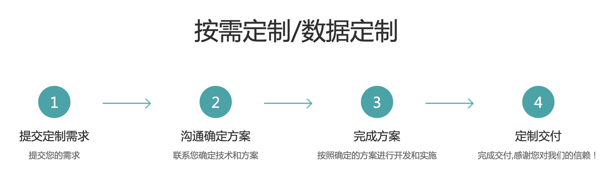

## 微信
   扫描微信二维码，技术交流。

## 联系我们

+ 微信号： techflag  

+ 电话： 13505146123

+ 邮箱： wangtao@stonedt.com

+ 公司官网：[www.stonedt.com](http://www.stonedt.com)

欢迎您在下方留言，或添加微信与我们交流。

## License & Copyright

Copyright (c) 2014-2022 思通数科 StoneDT, All rights reserved.

Licensed under The GNU General Public License version 3 (GPLv3)  (the "License"); you may not use this file except in compliance with the License. You may obtain a copy of the License at

<https://www.gnu.org/licenses/gpl-3.0.html>

Unless required by applicable law or agreed to in writing, software distributed under the License is distributed on an "AS IS" BASIS, WITHOUT WARRANTIES OR CONDITIONS OF ANY KIND, either express or implied. See the License for the specific language governing permissions and limitations under the License.