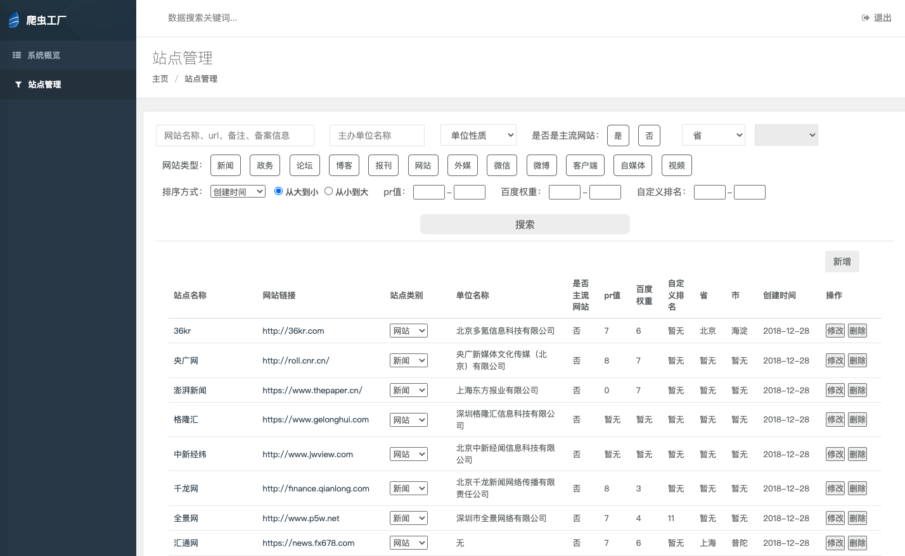
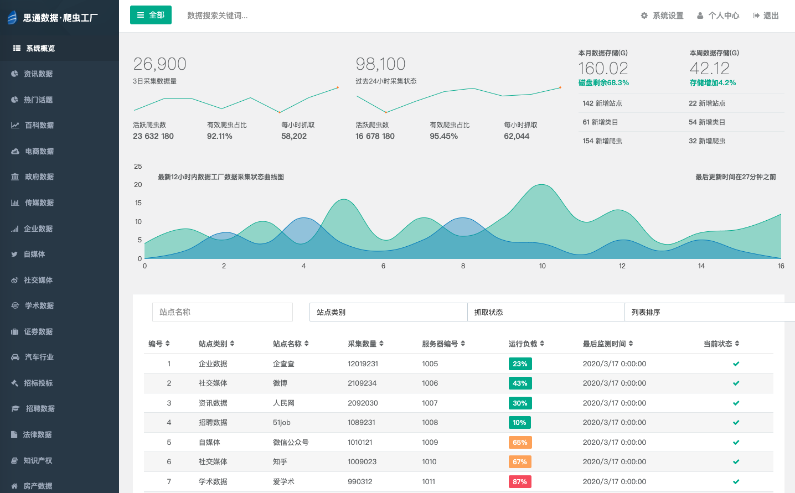
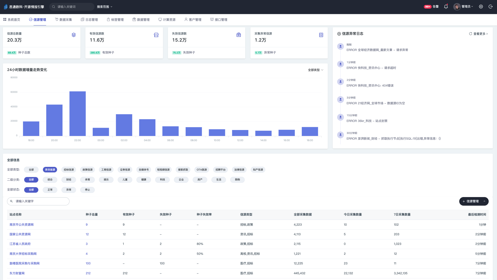

## 项目简述
爬虫，在很多人眼里很简单、廉价一点都不奇怪，因为网上有大量9.9块Python培训课，其中包含爬虫教学。

爬虫，在多数人眼里是灰色产业，这也不奇怪。中国在2019年出现了很多“大数据”公司，他们采用了爬虫技术窃取用户隐私。

但是，爬虫，一词对我们来说是一门博大精深的技术，掌握这门技术是不容易的，这门技术更不是为灰色产业服务的。

 
爬虫，一词，让我直接的联想到的是Google以及很多顶尖技术和团队，绝不是灰色产业和简单的技术。

  
传说中，美国中央情报局（CIA）创建了一个开放源代码中心负责收集，研发生产和推广[开源情报（OSINT）](https://wiki.mbalib.com/wiki/%E5%BC%80%E6%BA%90%E6%83%85%E6%8A%A5)，而开源情报的90%大部分数据来源就是互联网和公开数据源。

因此，2021年末，我们给爬虫技术和数据采集，有了一个新的定义： **[开源情报（OSINT）](https://wiki.mbalib.com/wiki/%E5%BC%80%E6%BA%90%E6%83%85%E6%8A%A5)** 。

 
大多数创业团队初期都是手工作坊。

在2017年初，我们跟其他的团队也没有例外。

刚刚开始抓取互联网数据的时候，我们采用的是最原始的代码开发java和Python。

由于，我们的运气和勤劳 团队和名气慢慢变大，手工作坊的模式反而给我们带来巨大的维护成本以及极低的稳定性。
  
于是，我们狠下心来，开始研发一套可以管理分布式的爬虫系统，我们定义为： **爬虫工厂** 。

梦想总是美好的，现实总是残酷的。

在研发的过程中我们一次次的试错和尝试，让我们积累了很多经验与总结。

截止积累到2021年9月份，

我们最后决定将之前研发的系统重新定义和研发，代号为： **发动机计划** 。

最后，到2021年12月份，

推到，重来，再推到，再重来.... 整个项目设计方案过了3个月才完成，目前我们还在砺砺前行。

迄今为止，我们对此的投入的研发费用早已超过的一辆劳斯莱斯汽车的售价。

2022年，新年伊始，

我们做了一个更大的决定，将我们的研发成果全部开源！

目的是为了能让更多的人了解我们，使用我们的研发成果，或者参与我们的项目。

我们相信： **把任何事情做到极致，就是一门艺术！** 

  
## 开源技术栈
- Java EE
- SpringBoot
- HttpClient
- webMagic
- Spider-flow
- Redis
- MySQL
- VUE

## 信源管理
信源，信息来源的简称。
  
我们需要对采集 类型，内容，平台，地区 等多种属性进行管理。我们对此开发了三代信源管理平台。
一代产品形态

二代产品形态

三代产品形态
 

## 站点画像  

采用模拟浏览器请求技术实现深度和广度抓取算法，总体分3个环节,对整个站点进行 1)全站扫描、2)数据储存、3)特性分析。  
- siteMeta  
识别整个网站的结构，并且解析存储，给每一个抓取的网站都建立一个“小档案”库。    
- siteIndex  
在识别基础上把所有网页都预存储下来，并且提取各种特征值进行分析计算，从站点目录，到站点栏目，以及每个抓取目标页面都会标记不同的特性参数。   
- siteFeatures 
最后将整体分析演算的结果，还原成这个网站的抓取画像和特性，以便于机器将会知道采用哪种抓取策略自动去匹配这个网站的特性抓取，基于这样的设计可以实现大规模数据采集无人值守的效果，也就是百度、谷歌 这些大型搜索引擎实现的数据效果。 

用“探头机器人”对整个网站预抓取一遍，相当于一个先头部队，把抓取网站的情况搞清楚以后，很快机器就知道采取哪种采集策略，大量需要采集的网站，只有极小的部分需要人工干预采集，而且更不需要编写一行爬虫采集代码，完全是自动化及低代码化大规模数据采集。

## 数据抓取
- 自动抓取  
有了网站的画像属性，就知道匹配那种采集抓取策略了，大部分网站就能自动抓取就自动识别抓取数据，无需人工干预。  

- 人工配置  
有的网站抓取难度大，采用可视化技术将整个站点的标签提取出来给开发工程师，他们将可以快速的对网站的抓取进行配置。
我们在采集任何一个网站的时候将会有各种“探头”对网站的结构，广告位，关键性内容，导航栏，分页，列表，站点特性，站点数据量，抓取难易度，站点更新频率，等等。

## 数据暂存
如果把数据直接储存到系统大数据库里，一旦有大量采集的脏数据下来就是浪费时间和精力，所有数据都会预演储存一遍，储存完成后会有程序对此核对监测，以免数据字段漏存，错存。如果在暂存环节发现储存错误，将会及时对研发工程师提醒，告知错误内容，让其对此修正。
  

## 分布式采集
- 控制器

- 分发器

- 执行器

  

## 低代码配置
  

## 爬虫管理
  

## 反爬策略
  

## 采集日志
- 日志跟踪ID
  

- 数据生命周期
  

## 数据解析
- 自动解析

  

## 数据储存
通过kafka中间件将数据通过消息的形式发送给储存端子系统。

    
