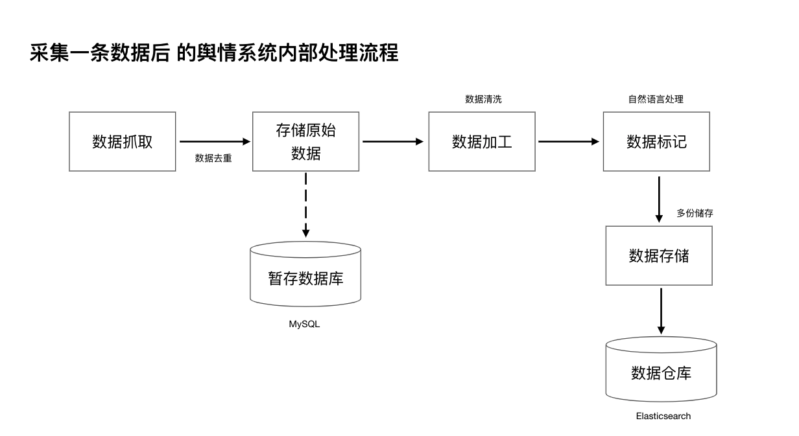

# 开源舆情 【数据处理】部分技术架构说明文档
（待续，未完...）

## 简述

经历了很多版本的迭代升级，期间采用过机器学习、深度学习、tensorflow 和 PaddlePaddle，经历大量的开发测试与项目实战经验。

## 开源技术栈
(开源技术清单)

## 技术架构

(思维导图)

## 数据处理流程

## 数据总线

  通过SmarterAPI与Elasticsearch对接，将内部整套数据处理流程完成后对外输出。

## 数据去重
-   URL去重
   采用了redis集群

-   内容去重
   采用Elasticsearch内部的查询将文章标题一样的内容检索过滤掉。

## 数据清洗
自动提取字段，标题、正文、时间、作者、来源 等。

## 数据标记

### 实体识别
-   在HaNLP的基础上进行训练和二次开发，在实战的过程中收集数据样本以及对数据样本标注是最痛苦的事情，为此，我们还开发了一款可以辅助人工标记的工具。

### 情感分析    
   百度飞桨

### 高频词分词
-   自研算法

### 文本分类

-  由清华大学自然语言处理实验室推出的 [THUCTC(THU Chinese Text Classification)](http://http://thuctc.thunlp.org/)

### 相似文章

  将文章通过“海明距离”算法生成加密串码存储在clickhouse集群中，通过clickhouse距离查询方法实现，文章相似度聚类。

### 事件分类

-  自研算法

### 行业分类

-   自研算法

## 数据存储

分为多个部分存储，MySQL、redis、kafak、Elasticsearch、MongoDB、clickhouse。

-  MySQL 

   在系统中储存两部分相关的信息内容，系统配置和临时脏数据储存。

- redis

  在系统中除了作为系统缓存，还作为站点数据采集的index索引库。

- kafak

  由于数据处理的过程比较多，而且数据量很大，因此采用分布式以及异步的方式对海量数据加工处理。

- Elasticsearch

  储存加工好的数据，以及打上各种标签的数据，储存在分布式搜索中，这样便于用户对数据的检索。

- MongoDB

  带样式的文章正文原始网页储存在MongoDB中。

- Clickhouse

  将每篇文章指纹及海明距离储存在clickhouse中，以便于对相似度和文章主题聚类的计算。

## 数据运维
###  数据清理
   
需要定期对  Elasticsearch、Mongodb 中存储的数据删除，同时还要将Mongodb中的表删除，否则磁盘空间容量不会减少。

###  数据备份

